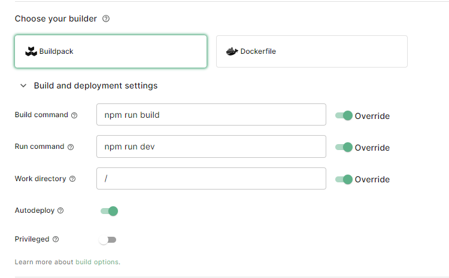

# discordgoのフロントエンド
# 使い方
サーバーを立てる  

https://github.com/maguro-alternative/discord_go_bot_pro

環境変数を設定する  
上記のサーバーのURLのみ  
```
VITE_SERVER_URL=http://localhost:3000
```

## koyebで動かす場合
同一ドメインで動かす際に、vercelではなくkoyebを使う場合  
参考: https://zenn.dev/maguro_alterna/articles/65906deef48e2b  
以下の画像のように設定する  


